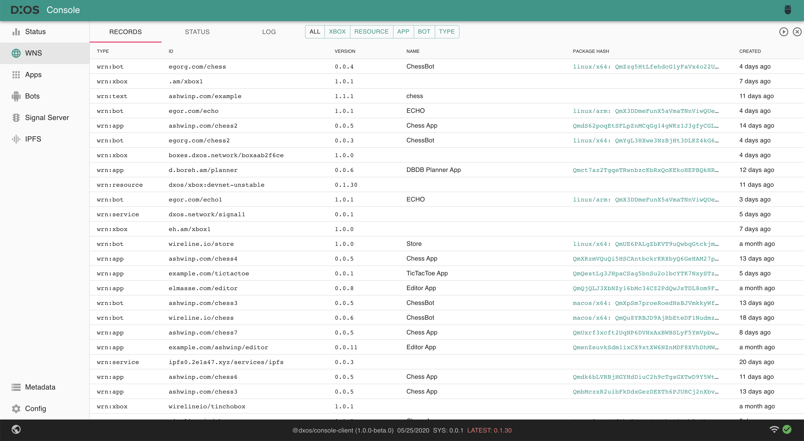

# Console

Laconic Kubenet GraphQL server and console application.

User interface for submitting and reading records registered on Laconic.



## Development

* Clone the required repos:
  * [laconicd](https://github.com/cerc-io/laconicd)

    ```bash
    git clone git@github.com:cerc-io/laconicd.git
    ```

  * [debug](https://github.com/lirewine/debug)

    ```bash
    git clone git@github.com:lirewine/debug.git
    ```

  * [gem](https://github.com/lirewine/gem)

    ```bash
    git clone git@github.com:lirewine/gem.git
    ```

* Run the `laconicd` chain:
  * In [laconicd](https://github.com/cerc-io/laconicd) repo, checkout to a different branch (see [issues](#issues) below)

    ```bash
    git checkout console
    ```
  
  * Start the chain

    ```bash
    ./init.sh
    ```

* Run the laconic-console app
  * In [laconic-console](https://github.com/cerc-io/laconic-console) repo, install dependencies

    ```bash
    yarn
    ```

  * Register the dependencies to link
    * `lirewine/debug`
      * In [debug](https://github.com/lirewine/debug) repo, checkout to release version

        ```bash
        git checkout v1.0.0-beta.78
        ```

      * Install and build packages

        ```bash
        # Install dependencies and build packages
        yarn && yarn build
        ```

      * Run `yarn link` in repo root

        ```bash
        yarn link
        ```

    * `lirewine/gem-core`
      * In [gem](https://github.com/lirewine/gem) repo, checkout to release version

        ```bash
        git checkout v1.0.0-beta.26
        ```

      * Install and build packages

        ```bash
        # Install dependencies and build packages
        yarn && yarn build
        ```

      * Change directory to core package and run `yarn link`

        ```bash
        cd packages/core

        # Register package to link
        yarn link
        ```

  * Link the packages in `laconic-console`
    * In root of [repo](https://github.com/cerc-io/laconic-console), run

      ```bash
      yarn link "@lirewine/debug"
      yarn link "@lirewine/gem-core"
      ```

  * Change directory to [packages/console-app](https://github.com/cerc-io/laconic-console/tree/main/packages/console-app) and start the react app

      ```bash
      # Change directory
      cd packages/console-app/
      
      # Start app
      CONFIG_FILE=config-local.yml yarn start
      ```

  * Open console-app at <http://localhost:8080>

  * To view records in the app, test suite in laconic-sdk can be run

    * Clone the [laconic-sdk](https://github.com/cerc-io/laconic-sdk) repo:

      ```bash
      git clone git@github.com:cerc-io/laconic-sdk.git
      ```

    * In [laconic-sdk](https://github.com/cerc-io/laconic-sdk) repo, copy [.env.example](https://github.com/cerc-io/laconic-sdk/blob/main/.env.example) file and create a `.env` file

      ```bash
      cp .env.example .env
      ```

    * Export the private key using:

      ```bash
      laconicd keys export mykey --unarmored-hex --unsafe
      ```

    * Copy the private key exported above and assign it to variable `PRIVATE_KEY` in the `.env` file.

    * Also change value of `COSMOS_CHAIN_ID` in `.env` file

      ```env
      COSMOS_CHAIN_ID=ethermint_9000-1
      ```

    * Install dependencies

      ```bash
      yarn
      ```

    * Run the tests in laconic-sdk repo:

      ```bash
      yarn test
      ```

      *NOTE*: One test from [util.test.ts](https://github.com/cerc-io/laconic-sdk/blob/main/src/util.test.ts) fails as mentioned in the [PR](https://github.com/cerc-io/laconic-sdk/pull/5#issuecomment-1299572012)

    * Open console-app at <http://localhost:8080> to view the records.

## Issues

* [Changes](https://github.com/cerc-io/laconicd/compare/main...console) in laconicd (exists in [console branch](https://github.com/cerc-io/laconicd/tree/console)) for running with console app can be pushed once the following PRs (for [fixing laconic-sdk test suite](https://github.com/cerc-io/laconic-sdk/issues/8)) are merged:
  * <https://github.com/cerc-io/laconic-sdk/pull/15>
  * <https://github.com/cerc-io/laconicd/pull/70>

* Once `lirewine/debug` and `lirewine/gem` packages are published to gitea (like [lirewine/react-ux](https://git.vdb.to/cerc-io/-/packages/npm/@lirewine%2Freact-ux/1.1.0-beta.0) package), yarn linking can be removed from development setup.
